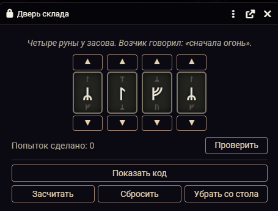
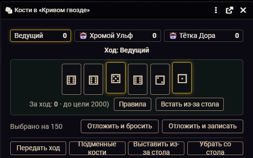
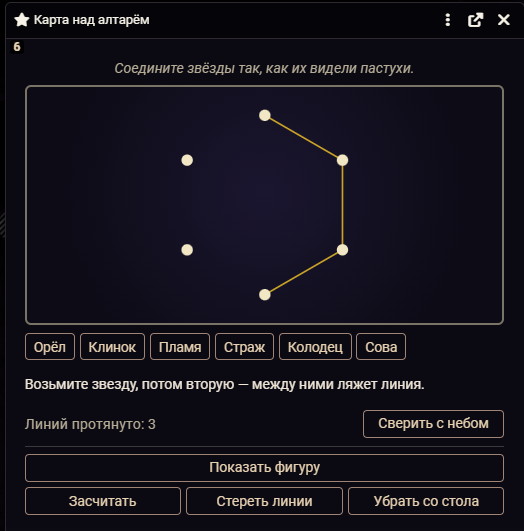
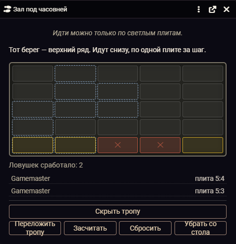
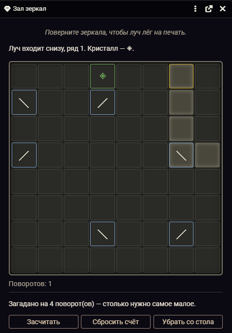

# UO · Игры и загадки

Загадки и настольные игры для Foundry VTT, за которыми сидит весь стол:
ведущий выкладывает, игроки решают, все видят одно и то же в один и тот же миг.

<table>
  <tr>
    <td width="50%"></td>
    <td width="50%"></td>
  </tr>
  <tr>
    <td></td>
    <td></td>
  </tr>
</table>

Загадка за столом обычно превращается в пересказ: ведущий описывает, что видно,
игроки говорят, что делают. Здесь загадка ложится на стол окном: один крутит,
остальные смотрят, и видно это у всех сразу.

## Установка

В Foundry, в окне установки модулей: **«Установить модуль»**, внизу окна
вставить адрес манифеста:

```
https://github.com/Nikifour/uo-igry/releases/latest/download/module.json
```

Дальше модуль обновляется сам. Foundry **v13–v14**, система **dnd5e 5.0+**.
Для тайлов, которые открывают загадку и отпирают дверь, нужен
[Monk's Active Tile Triggers](https://foundryvtt.com/packages/monks-active-tiles);
для объёмных костей — Dice So Nice. Без них всё остальное работает.

Справка едет вместе с модулем — компендиум «Игры и загадки · Как пользоваться»,
по-русски и по-английски.

## Одиннадцать загадок

**Кодовый замок.** Диски с символами — цифры, руны, буквы, знаки светил или свои.
Подсказка «сколько дисков стоят верно», предел попыток общий или на каждого.

**Мозаика.** Пятнашки из вашей картинки, от 2 × 2 до 5 × 5.

**Врата с надписями.** Створки, на них высказывания, часть лжёт. Толкнуть надо одну.

**Созвездие.** Протянуть линии между звёздами в верную фигуру.

**Карта путей.** Миры и порталы, часть односторонних: пройти через нужные и выйти в цель.

**Зал зеркал.** Довести луч до кристалла, разворачивая зеркала. Сложность — число
поворотов до решения, и это не оценка: зал проверяется перебором перед выкладкой.

**Зал призм.** То же, но лучей несколько и они цветные: красный с зелёным дают жёлтый.

**Зал плит.** Через зал ведёт единственная тропа; найденные ловушки остаются
помеченными, и зал становится общей памятью стола.

**Устройство с разорванным руководством.** Один у механизма, у остальных — разные
обрывки инструкции, и порядок выводится только из всех вместе.

**Череда картинок.** Расставить картинки в верном порядке: фрески по событиям,
гербы по старшинству.

**Надпись.** Шифр подстановкой — настоящая криптограмма — или колесом со сдвигом.

<p align="center"></p>

## Три игры

**Кости** — шесть костей, набрать очки и вовремя остановиться, иначе набранное
сгорит. **Двадцать одно** — кубики от к4 до к20, каждый раз за раунд, перевалил
за 21 — проиграл. **Счастливчик Джо** — воровская игра, которой решают споры.

За стол можно подсадить трактирных соперников со своим нравом: осторожный
трактирщик, безрассудный наёмник, счетовод. Ставки, банк, возможность встать
из-за стола — и шулерство: подменные кости в рукаве, проверка Ловкости рук
против внимания зрителей, итог шёпотом одному ведущему.

## Для ведущего

**Заготовки.** Загадку можно собрать до партии и выложить одним нажатием — обычно
или скрытно, чтобы игроки увидели её не раньше времени. Склад лежит в журнале,
видимом только ведущему.

**Ответ не уходит к игрокам.** Считает всегда клиент ведущего, ответ хранится
у него и в мир не пишется: иначе разгадку читали бы через F12.

**Рычаги.** Засчитать, сбросить, убрать со стола, подсмотреть код — на месте,
не выходя из игры.

**Тайл на карте.** Когда загадку решают, срабатывает событие `uo-igry.solved` —
за него цепляется тайл Monk's Active Tiles и открывает дверь или запускает сцену.

```js
UOIgry.panel()                                      // панель ведущего
UOIgry.presets.put("plity", "Зал", { скрытно: true })   // выложить заготовку скрытно
UOIgry.tables                                       // что сейчас на столе
```

## Поддержать

Модуль бесплатный. Новости о выходе инструментов и разборы того, как они
устроены, — на Boosty: **[boosty.to/unshaved_orange](https://boosty.to/unshaved_orange)**.
Там же можно сказать спасибо.

Ошибки и пожелания — в [Issues](https://github.com/Nikifour/uo-igry/issues).

## Лицензия

Скачать и поставить может каждый; пользоваться в своих играх — как угодно,
включая платные и в прямой передаче. Выкладывать модуль где-либо ещё,
продавать и включать в чужие сборки нельзя. Все права за автором.
Полный текст — в [LICENSE](LICENSE).

---

## In English

**Games and Puzzles** brings interactive puzzles and tavern games to a Foundry VTT
table: the GM lays a puzzle out, players solve it together and see every move
at once. Eleven puzzles — combination lock, sliding mosaic, gates of truth and
lies, constellation, portal map, hall of mirrors, hall of prisms, hall of slabs,
a device with a torn manual, picture order, ciphers — and three dice games with
bot opponents, stakes and loaded dice. The interface is in Russian and English —
it follows Foundry's language, or pick one in the module settings; an English
guide ships as a compendium.

Install with the manifest URL:
`https://github.com/Nikifour/uo-igry/releases/latest/download/module.json`
