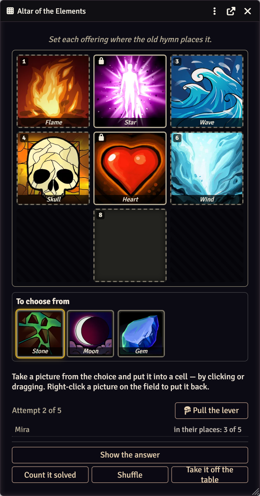
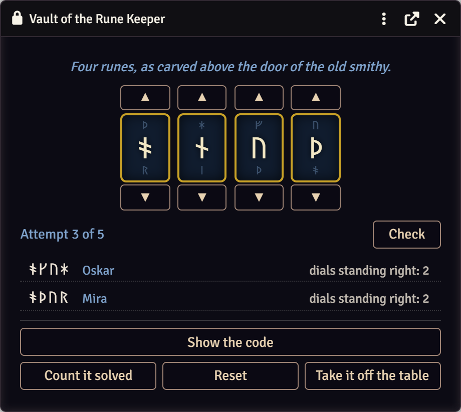
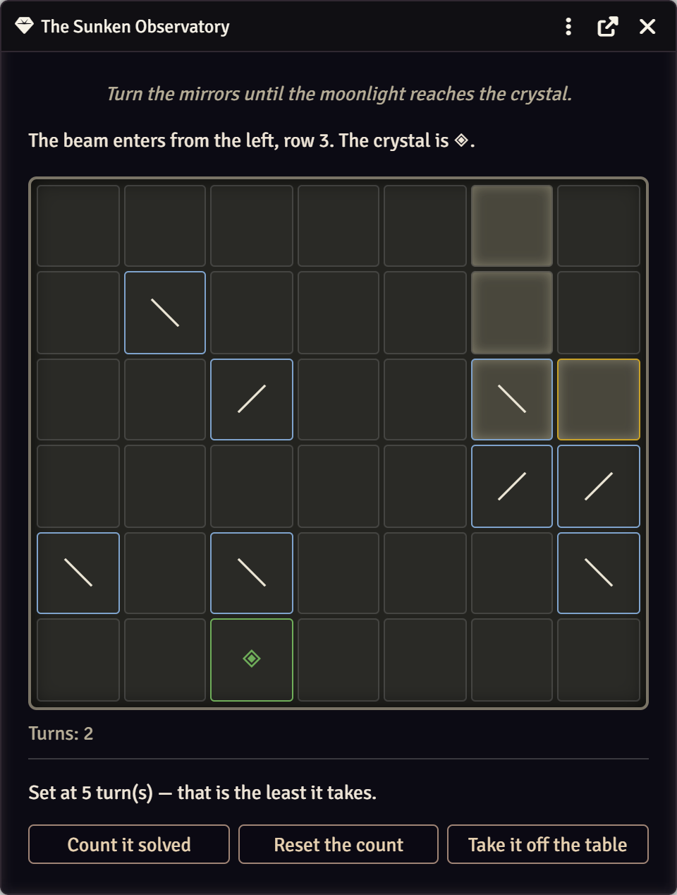
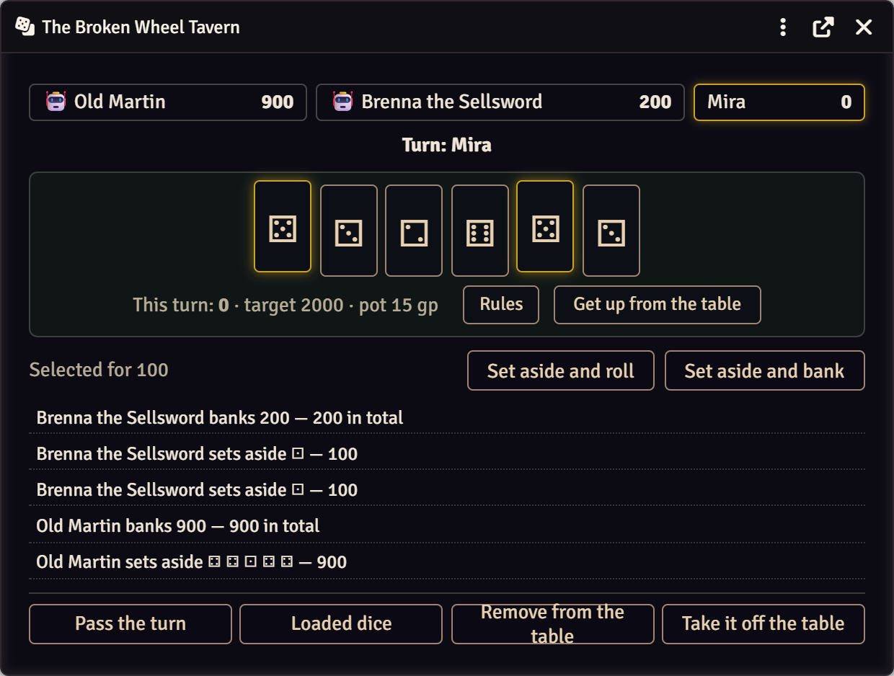
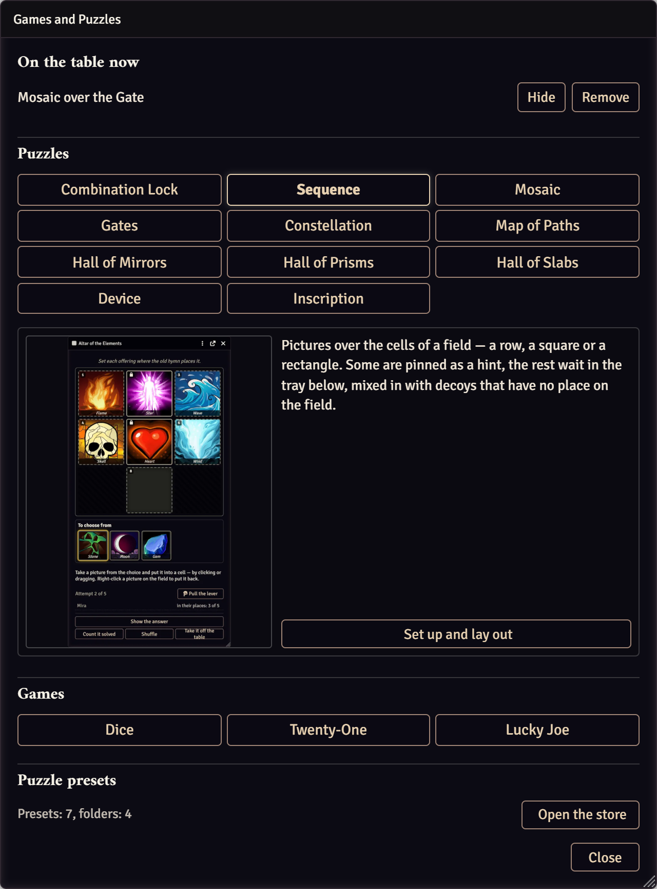
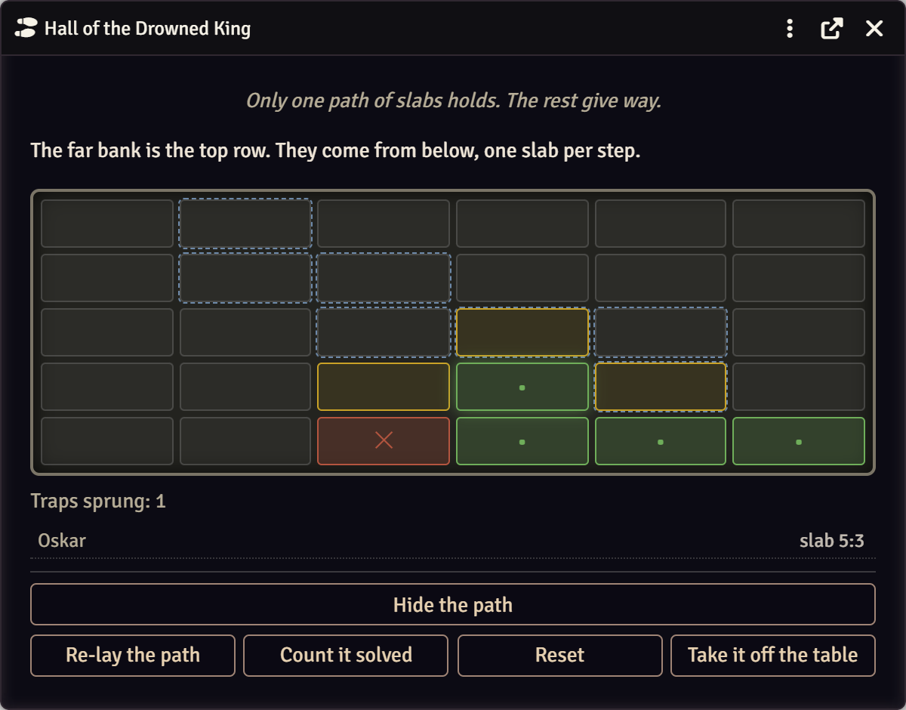
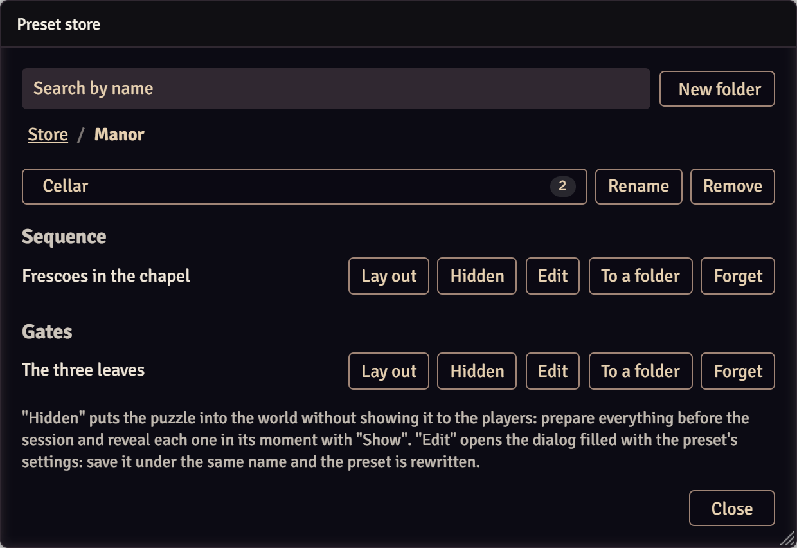

# UO · Игры и загадки

[English](README.md) · **Русский**

Загадки и настольные игры для Foundry VTT, за которыми сидит весь стол:
ведущий выкладывает, игроки решают, все видят одно и то же в один и тот же миг.

<table>
  <tr>
    <td width="50%"></td>
    <td width="50%"></td>
  </tr>
  <tr>
    <td></td>
    <td></td>
  </tr>
</table>

Загадка за столом обычно превращается в пересказ: ведущий описывает, что видно,
игроки говорят, что делают. Здесь загадка ложится на стол окном: один крутит,
остальные смотрят, и видно это у всех сразу. Ответ проверяет клиент ведущего —
к игрокам он не уходит.
<p align="center"></p>

В панели ведущего шестнадцать затей разложены по родам — десять загадок,
три устройства, три игры, — а щелчок по названию разворачивает описание
с примером, до того как что-то настраивать.

## Установка

В Foundry, в окне установки модулей: **«Установить модуль»**, внизу окна
вставить адрес манифеста:

```
https://github.com/Nikifour/uo-games-and-puzzles/releases/latest/download/module.json
```

- Foundry **v13–v14**, система **dnd5e 5.0+** (игры в кости берут монеты
  и проверки навыков с листов персонажей).
- По желанию: [Monk's Active Tile Triggers](https://foundryvtt.com/packages/monks-active-tiles) —
  тайл выкладывает загадку и отпирает дверь, когда её решат; Dice So Nice —
  объёмные кости. Без них всё остальное работает.
- Язык — **русский и английский**: как в Foundry или на выбор в настройках модуля.
- Справка едет вместе с модулем — компендиум «Игры и загадки · Как пользоваться».

## Как это устроено

1. Ведущий открывает панель (кнопка **«Игры и загадки»** в панели заметок
   или `UOIgry.panel()`) и выкладывает загадку — сразу или из заготовки,
   собранной до партии.
2. У каждого игрока открывается окно. Ходы уходят клиенту ведущего, он их
   применяет и рассылает итог — экраны у всех совпадают.
3. Когда загадку решают, в чат уходит сообщение, срабатывает событие
   и, если задан, макрос — тайл может открыть дверь.

## Десять загадок

| Загадка | Что делают игроки |
|---|---|
| **Кодовый замок** | Крутят диски: цифры, руны, буквы, знаки светил или свои символы. Подсказка «сколько дисков стоят верно», предел попыток общий или на каждого. |
| **Череда** | Раскладывают картинки по клеткам строки, квадрата или прямоугольника. Часть закреплена как подсказка, остальное в выборе под полем вперемешку с приманками. |
| **Мозаика** | Пятнашки из вашей картинки, от 2 × 2 до 5 × 5. Всегда собираются. |
| **Врата** | Створки с высказываниями, часть лжёт. Толкнуть надо одну. |
| **Созвездие** | Протягивают линии между звёздами в верную фигуру. |
| **Карта путей** | Миры и порталы, часть односторонних: пройти через нужные и выйти в цель. |
| **Зал зеркал** | Разворачивают зеркала, чтобы довести луч до кристалла. Сложность — число поворотов до решения, зал проверяется перебором перед выкладкой. |
| **Зал призм** | То же, но лучи цветные и их несколько: красный с зелёным дают жёлтый. |
| **Зал плит** | Через зал ведёт единственная тропа; найденные ловушки остаются помеченными, и зал становится общей памятью стола. |
| **Надпись** | Шифр подстановкой — настоящая криптограмма — или колесо со сдвигом. |

<p align="center"></p>

## Три устройства

Загадку решают, в игру играют, а у устройства **работают вместе**: один
видит, другие делают. Подсказок у того, кто видит, нет — есть только то,
что он сумеет объяснить словами.

| Устройство | Как это выглядит за столом |
|---|---|
| **Устройство с разорванным руководством** | Один у рычагов, у остальных — разные обрывки инструкции, розданные лично; порядок выводится только из всех обрывков вместе. |
| **Зал призм (У)** | Лучи, зеркала и их номера видит только штурман. Остальные стоят у пульта с подписанными рычагами, и какой рычаг какое зеркало поворачивает, знает лишь он. Рычаги делятся на пульты, у пульта может быть свой игрок. |
| **Кодовый замок (У)** | Диски видит штурман, он же жмёт «Проверить», а проворачивают их остальные. Рычаг двигает диск на шаг вперёд; два рычага на диск — крутить в обе стороны. |

Всем троим можно поставить **время**: минуты и секунды по часам сервера.
Вышло — механизм замирает, и «Сбросить» заводит часы заново.

## Три игры

- **Кости** — шесть костей: набрать очки и вовремя остановиться, иначе
  набранное за ход сгорит.
- **Двадцать одно** — кубики от к4 до к20, каждый раз за раунд; перевалил
  за 21 — проиграл.
- **Счастливчик Джо** — воровская игра, которой решают споры.

За стол можно подсадить **трактирных соперников** со своим нравом: осторожный
трактирщик, безрассудный наёмник, счетовод. **Ставки** списываются с листов,
из-за стола можно встать посреди партии — а можно **сжульничать**: подменные
кости в рукаве, проверка Ловкости рук против внимания зрителей, итог шёпотом
одному ведущему.

## Для ведущего

- **Заготовки.** Загадку можно собрать до партии и выложить одним нажатием —
  обычно или скрытно, чтобы показать позже. В складе они лежат по папкам —
  по сценам или местам, с вложением, — и находятся поиском по названию.
  Сам склад — журнал, видимый только ведущему: уезжает вместе с миром.

<p align="center"></p>
- **Ответ не уходит к игрокам.** Он хранится в клиенте ведущего и в мир
  не пишется — через консоль браузера его не прочесть.
- **Рычаги.** Засчитать, сбросить, спрятать, убрать со стола, подсмотреть
  ответ — прямо из окна загадки.
- **Тайлы и макросы.** При разгадке срабатывает событие `uo-igry.solved`
  с состоянием стола; за него цепляется Monk's Active Tiles или свой макрос.

```js
UOIgry.panel()                                          // панель ведущего
UOIgry.presets.put("plity", "Склеп", { скрытно: true }) // выложить заготовку скрытно
UOIgry.tables                                           // что сейчас на столе
Hooks.on("uo-igry.solved", стол => { /* открыть дверь */ })
```

## Поддержать

Модуль бесплатный. Новости о выходе инструментов и разборы того, как они
устроены:
**[patreon.com/unshavedorange](https://www.patreon.com/unshavedorange)** · **[boosty.to/unshaved_orange](https://boosty.to/unshaved_orange)** — из России и СНГ платёж проходит здесь.

Ошибки и пожелания — в [Issues](https://github.com/Nikifour/uo-games-and-puzzles/issues).

<!-- поддержавшие -->

<!-- /поддержавшие -->

## Лицензия

Скачать и поставить может каждый; пользоваться в своих играх — как угодно,
включая платные и в прямой передаче. Выкладывать модуль где-либо ещё,
продавать и включать в чужие сборки нельзя. Все права за автором.
Полный текст — в [LICENSE](LICENSE).
